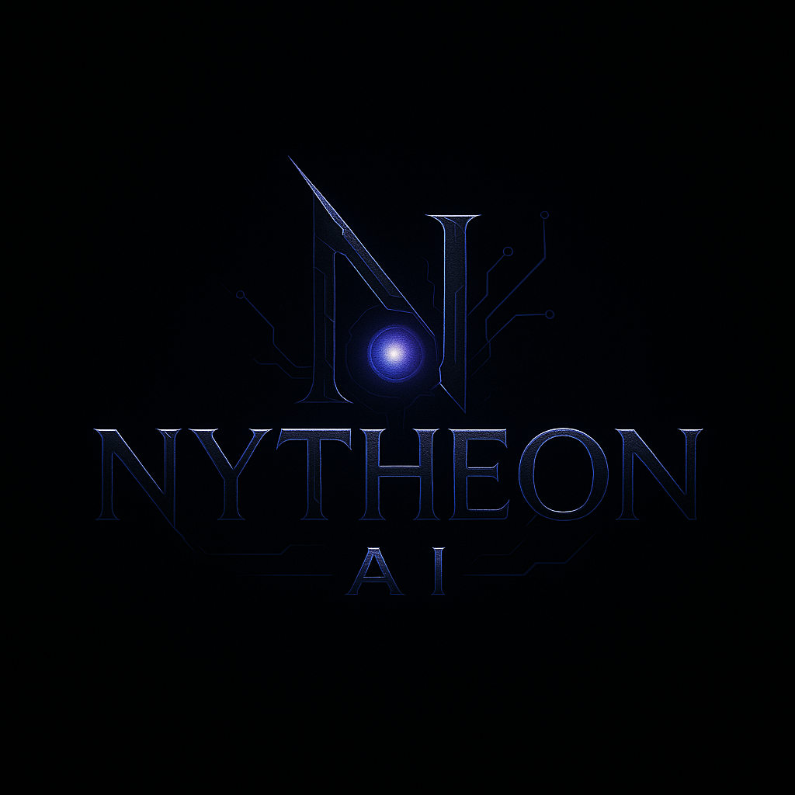

  

   

  

  <h1>Hey, I'm Nytheon</h1>
  <h3>AI Developer &middot; NLP Engineer &middot; Full-Stack Technologist</h3>

  

  

    
    
    
  

---

### &nbsp;&nbsp;About Me

I'm a passionate AI developer who loves crafting intelligent systems that solve real-world problems. I focus on natural language processing, conversational AI, and building complete products end to end.

- **Natural Language Processing** — language models, embeddings, and text intelligence
- **Conversational AI & Agents** — chat systems, tool use, and streaming responses
- **Machine Learning & Deep Learning** — training, evaluation, and deployment
- **Full-Stack Engineering** — from idea to shipped product

---

### &nbsp;&nbsp;Tech Stack

  

---

### &nbsp;&nbsp;GitHub Analytics

  
  

  

  

---

### &nbsp;&nbsp;Featured Projects

| Project | Description |
|---|---|
| [Ai-Chatbot](https://github.com/nytheon/Ai-Chatbot) | Free, keyless streaming AI chatbot |
| [NytheonAi-Documentation](https://github.com/nytheon/NytheonAi-Documentation) | Nytheon AI documentation site |
| [wave-fm](https://github.com/nytheon/wave-fm) | Wave FM &mdash; news and talk radio player |
| [fm](https://github.com/nytheon/fm) | Professional news and talk radio player |

---

### &nbsp;&nbsp;Connect with Me

  
  
  

  &copy; 2026 Nytheon &mdash; built with passion for AI

