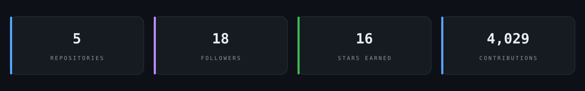
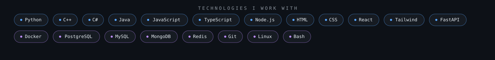
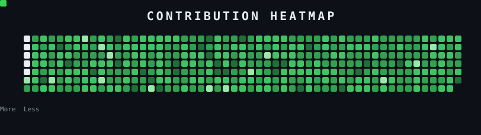

  

---

### &nbsp;&nbsp;About Me

I'm a passionate AI developer crafting intelligent systems that solve real-world problems - from natural language processing and conversational AI to full-stack products shipped end to end.

- **Natural Language Processing** - language models, embeddings, and text intelligence
- **Conversational AI & Agents** - chat systems, tool use, and streaming responses
- **Machine Learning & Deep Learning** - training, evaluation, and deployment
- **Full-Stack Engineering** - from idea to shipped product

  

  

  

  

---

### &nbsp;&nbsp;Connect with Me

  &nbsp;&nbsp;&nbsp;
  &nbsp;&nbsp;&nbsp;
  

  &copy; 2026 Nytheon - built with passion for AI

