  

    

  

   

  

    
    
    
  

---

### About Me

I am a passionate AI developer crafting intelligent systems that solve real-world problems - from natural language processing and conversational AI to full-stack products shipped end to end.

I enjoy building from scratch, optimising existing systems and constantly learning what comes next.

**What I focus on**

- **Natural Language Processing** - language models, embeddings and text intelligence
- **Conversational AI &amp; Agents** - chat systems, tool use and streaming responses
- **Machine Learning &amp; Deep Learning** - training, evaluation and deployment
- **Full-Stack Engineering** - from idea to a shipped product

---

### Tech Stack

  

---

### GitHub Stats

  
  

  

  

---

### Connect with Me

  
  
  

  &copy; 2026 Nytheon - profile auto-refreshes daily via GitHub Actions

